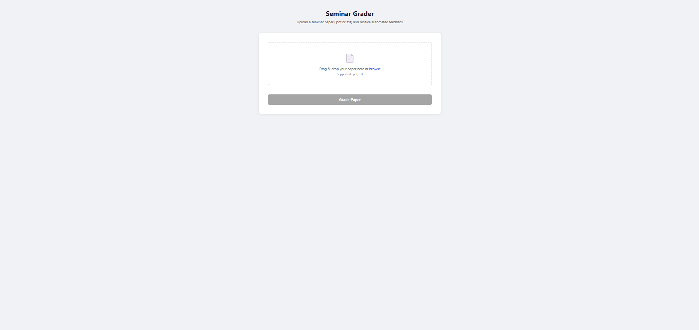

# AI-Powered Seminar Evaluation Platform

A Spring Boot application that automatically grades student seminar papers for a Computer Ethics course using a RAG (Retrieval-Augmented Generation) pipeline. Students upload a paper and receive a structured grade with section-level feedback, a final score out of 70, and a breakdown of all multipliers applied.

---

## How It Works

The system is built on a two-LLM pipeline grounded in a knowledge base of 31 real previously graded seminar papers.

```
Student uploads PDF or .txt
        ↓
Extract plain text + count words + detect inline citations (Java)
        ↓
LLM #1 - extract structural fingerprint (OpenRouter / GPT-4o)
        ↓
Embed fingerprint → similarity search → retrieve 4 most similar past papers (Cohere)
        ↓
LLM #2 - grade using past papers as few-shot examples (OpenRouter / GPT-4o)
        ↓
Apply multipliers deterministically in Java
        ↓
Return structured grade with feedback
```

### Why Two LLM Calls?

The first LLM call strips the paper down to a structural description, how it is written, not what topic it covers. This fingerprint is then used to search the knowledge base for papers with similar structural problems (missing citations, technical focus, weak conclusion). The second LLM call grades the new paper using those structurally similar papers as calibration examples, making the evaluation consistent with the professor's actual grading style.

---

## Grading System

All papers are graded out of **70 points** (the other 30 points are given by a professor).

| Section | Points | Criteria |
|---|---|---|
| Introduction | 0 – 10 | 150–200 words, explains topic, announces ethical focus |
| Body | 0 – 35 | Ethical analysis (not technical), concrete examples, inline citations |
| Conclusion | 0 – 25 | Synthesizes arguments, student's own stance and recommendations |

### Multipliers

Three multipliers are applied to the raw score deterministically in Java - not by the LLM:

**Citation factor**
- Sources cited inline with `[n]` or `(Author, Year)` → ×1.0
- Sources only listed at the end → ×0.7 (−30% penalty)

**Word count factor**
- 900–1100 words → ×1.0
- Under 900 → ×(n / 900)
- Over 1100 → ×(1100 / n)
- Under 500 or over 2000 → ×0.5

**Source count factor**
- 10+ sources → ×1.0
- Each missing source below 10 → −0.05
- Minimum → ×0.5

**Formula**
```
finalScore = (intro + body + conclusion) × citationFactor × wordCountFactor × sourceFactor
```

---

## Architecture

```
src/main/java/com/example/SeminarAnalysis/
├── config/
│   └── AppConfig.java               # RestClient beans for OpenRouter and Cohere
├── controller/
│   └── GradeController.java         # POST /api/grade - orchestrates the pipeline
├── dto/
│   ├── GradeResponse.java           # Full grading result returned as JSON
│   └── SectionGrade.java            # Score + feedback for one section
└── service/
    ├── ChatService.java             # Wrapper around OpenRouter chat completions API
    ├── EmbeddingService.java        # Wrapper around Cohere embeddings API
    ├── InMemoryVectorStore.java     # In-memory vector store with cosine similarity search
    ├── KnowledgeBaseLoader.java     # Loads knowledge_base.json into vector store on startup
    ├── DocumentTextExtractor.java   # Extracts text from PDF/txt, counts words and citations
    ├── StructuralExtractorService.java  # First LLM call - produces structural fingerprint
    ├── RagService.java              # Retrieves similar papers, formats few-shot examples
    └── GraderService.java           # Second LLM call - grades paper, applies multipliers in Java

src/main/resources/
├── static/
│   └── index.html                   # Frontend - single page HTML/CSS/JS
└── data/
    └── knowledge_base.json          # 31 annotated seminar papers (RAG knowledge base)
```

## Setup

### Prerequisites

- Java 26
- Maven
- An [OpenRouter](https://openrouter.ai) API key (free tier available)
- A [Cohere](https://cohere.com) API key (free trial available -  used for embeddings only)

### Installation

1. Clone the repository:
```bash
git clone https://github.com/ddamjanp/SeminarAnalysis.git
cd SeminarAnalysis
```

2. Copy the example properties file and fill in your API keys:
```bash
cp src/main/resources/application.properties.example src/main/resources/application.properties
```

3. Open `application.properties` and add your keys:
```properties
openrouter.api-key=YOUR_OPENROUTER_API_KEY_HERE
cohere.api-key=YOUR_COHERE_API_KEY_HERE
```

4. Run the application:
```bash
mvn spring-boot:run
```

5. Wait for the knowledge base to load. You will see this in the console:
```
Knowledge base ready - 31 papers indexed.
```

6. Open [http://localhost:8080](http://localhost:8080) in your browser.

---

## API

### `POST /api/grade`

Accepts a seminar paper and returns a structured grade.

**Request:** `multipart/form-data`, field name `file`, accepts `.pdf` or `.txt`

**Response:**
```json
{
  "intro": { "score": 6, "maxScore": 10, "feedback": "..." },
  "body": { "score": 8, "maxScore": 35, "feedback": "..." },
  "conclusion": { "score": 10, "maxScore": 25, "feedback": "..." },
  "citationPenalty": true,
  "wordCount": 276,
  "wordCountFactor": 0.5,
  "sourceCount": 3,
  "sourceFactor": 0.65,
  "rawScore": 24.0,
  "finalScore": 5.46,
  "overallFeedback": "...",
  "structuralIssues": ["no_inline_citations", "technical_focus_not_ethical"]
}
```

### `GET /api/health`

Returns `"Seminar Grader is running."` -  used to verify the application started correctly.

---

## Knowledge Base

The file `src/main/resources/data/knowledge_base.json` contains 31 annotated seminar papers used as the RAG knowledge base. These are real papers from a Computer Ethics course, graded by the professor, with section-level annotations generated to match the original grades and professor comments.

| Type | Count | Description |
|---|---|---|
| hybrid | 16 | Written using internet research + LLM assistance |
| no_llm | 10 | Written entirely without generative AI |
| only_llm | 5 | Written using only LLM output |

Each entry contains a structural fingerprint (the text that gets embedded for similarity search), section scores and annotations, multiplier values, structural issue tags, and the original professor grade and comment.

---

## Demo




